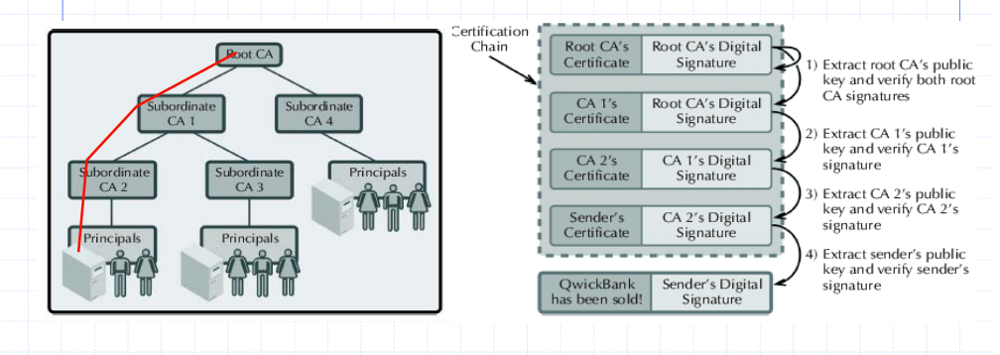

Title: 如何验证一个数字证书  
Date: 2014-06-21 15:43  
Tags: 安全, 数字证书  
Slug: how-to-validate-certificate  
Author: Goclis Yao  


首先，设要验证的这个数字证书为B，则它必然由某个CA发放。这里假设该CA的数字证书是存在你的电脑上的或从B到根CA的数字证书都存放在你的电脑上（对于层次结构CA）。出于简单考虑，这里取单层CA做分析，即根CA的数字证书在你的电脑上，设为A，待验证的证书B是由其发放的。

假设完毕，首先看看这个待验证的证书包含哪些消息吧。

对于一个RA（Registration Authority）的请求，CA会产生一对公私钥，公钥会被放在对应产生的数字证书中，私钥交给RA自己保管（怎么交的暂不考虑）。所以数字证书里必须包含的就是这个公钥。除此之外，还得有一系列的比如CA的名字，RA的信息等等。总之，这些信息会被包含成一个数字证书。

既然数字证书产生了，但它终究是个有格式的文件，我们下一步需要做的就是，保证它没有被篡改！所以，就需要颁发者对证书进行签名了，也就是对生成的数字证书进行摘要后，再用颁发者的私钥对其签名，然后将签名后的内容连同证书一起打包，这样才得到了一个可验证的完整的数字证书。

用密码学表示一下大概如下：

```
// 设生成的中间数字证书为 MB，最终发放的为B
则B = MB || E(HASH(MB))  // 这里E是用CA的私钥加密， || 表示拼接
```

接下来，看看是如何验证的。往下我们称MB为**内部证书**，B为证书。

1. 从获取到的证书B开始，根据签发该证书的CA的信息，顺着层次树往上找，直到找到根证书，这样就可以构成一条**证书链**。

2. 从证书链的顶端，往下验证。提醒一点，按照我们的假设，这条证书链上的证书在我们的PC上都是有的。首先是根证书，根证书是自签名的，拿出它的公钥，对发证书时顺带的那个加了密的消息摘要进行解密，再对内部证书使用证书中定义的摘要算法进行处理，将产生的结果进行比较，匹配则往下。

3. 从根证书下来后就不再是自签名了，所以需要使用上层的公钥对发证书时顺带的消息摘要进行解密，然后同样地，对内部证书摘要，比较结果，匹配则往下。

4. 直至最后一个证书，如果摘要都匹配，说明这个证书是有效的，没被人篡改。



当然！这一切成立的前提都是根证书没有问题！！所以，对自己PC上根证书的管理千万不能松懈。

